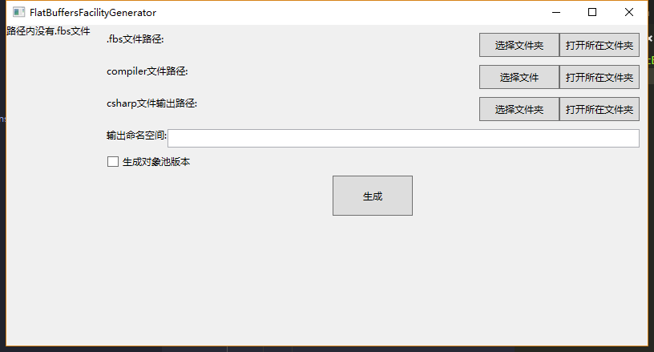

# FlatBuffersFacility

flatbuffers是google员工开发的一套编解码协议，可用作序列化存储或者网络协议序列化等等。序列化与反序列化非常快，就是编写非常麻烦，特别是有nested object的情况下，一不注意就容易出错。该项目主要是通过自动生成代码生成flatbuffers的encode decode代码，方便开发的速度。



下载项目中的public工具，是已经编译好的exe工具。工具界面如上图，选择好三个路径后，工具会将第一个路径中的所有fbs文件生成出对应的c#代码。

例如编写一个fbs文件：
```
namespace FlatBuffersProtocol;

table Enemy  
{
    id : int;
    position : Vec3;
    inventoryIds : [int];
    weapon : Weapon;
    teamId : int;
}

table Vec3
{
    x : float;
    y : float;
    z : float;
}

table Weapon
{
    id : int;
    ammo_capacity : int;
}
```

生成对应的c#代码后，就和正常的c#对象一样方便使用。
```csharp
        FlatBufferBuilder fbb = new FlatBufferBuilder(1024);

        Enemy enemy = new Enemy();

        enemy.id = 100;
        enemy.position = new Vec3();
        enemy.position.x = 10;
        enemy.position.y = 0;
        enemy.position.z = 200;
        enemy.weapon = new Weapon();
        enemy.weapon.id = 10032;
        enemy.weapon.ammo_capacity = 30;
        enemy.teamId = 1;
        for (int i = 0; i < 10; i++)
        {
            enemy.inventoryIds.Add(i * 3);
        }
        
        fbb.Clear();
        enemy.Encode(fbb);
        enemy = null;
        
        Enemy anotherEnemy = new Enemy();
        anotherEnemy.Decode(fbb.DataBuffer);
        Debug.Log(anotherEnemy.id);
        Debug.Log(anotherEnemy.weapon.ammo_capacity);
```

生成类的Encode和Decode方法中已经处理好了编码到flatbuffers格式的一切操作。

>工具支持生成到对象池版本，对象池相关配合代码在FlatBuffersFacility/Runtime/中。

## 注意事项
目前是早期版本，只支持生成到c#代码。暂时不支持struct和一些其他特性。
